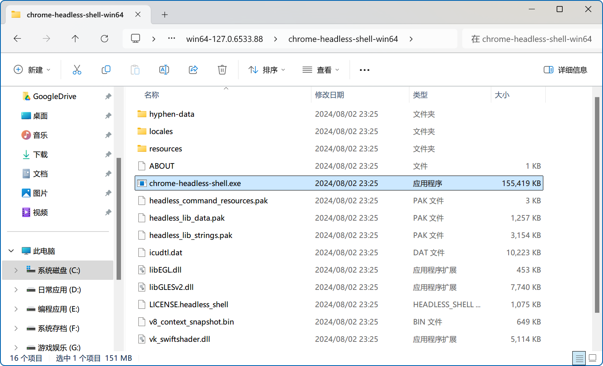
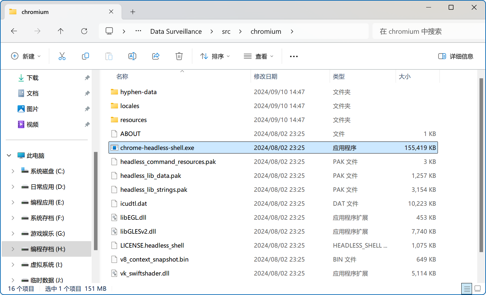

<div align="center"><h1>Data Surveillance</h1></div>

<div align="center"></div>

Data Surveillance 能够登录并抓取目标网址上的信息，并在主程序的 Message 区域上展示这些信息。

### 部署

```shell
npm start -dev
```

### 模块支持

程序需要 [Puppeteer](https://pptr.dev/) 支持：

```shell
npm i puppeteer # Downloads compatible Chrome during installation.
```

### 程序说明

- Title（顶部）：标题栏，提供静音、悬浮、最小化及关闭至托盘等功能；
- Message（左侧）：展示抓取的网页信息；
- Process（右上）：输出运行日志；
- Options（右下）：配置基本的登录信息。

<div align="center"></div>

### 悬浮窗体

使用标题栏中的悬浮按钮，可以启用小窗置顶模式，以展示 Message 区域信息：

<div align="center"></div>

### 托盘指示

| 程序状态 |                           图标指示                           |
| :------: | :----------------------------------------------------------: |
|  空闲中  |  |
|  运行中  |  |

### 说明

项目需要 [Puppeteer](https://pptr.dev/) 支持，如果参考 `src/sniff.ts` 编写嗅探脚本，那么务必将项目所需的 chrome.exe 或 chrome-headless-shell.exe 程序置于项目根目录的 `src/chromium` 目录下。

请在安装 [Puppeteer](https://pptr.dev/) 后找到用户目录内的 `.cache/puppeteer` 目录并定位至浏览器所在目录：

<div align="center"></div>

将目录内所有文件复制到项目根目录下的 `src/chromium` 目录中：

<div align="center"></div>

完成之后，再进行项目打包。

### 打包

项目打包命令：

```shell
npm run make
```

### 其他

项目使用 [Electron Forge](https://www.electronforge.io/) 框架，以下命令用于初始化 [vue-electron](https://www.electronforge.io/templates/vite) 项目：

```shell
npm init electron-app@latest my-new-app -- --template=vite
```

