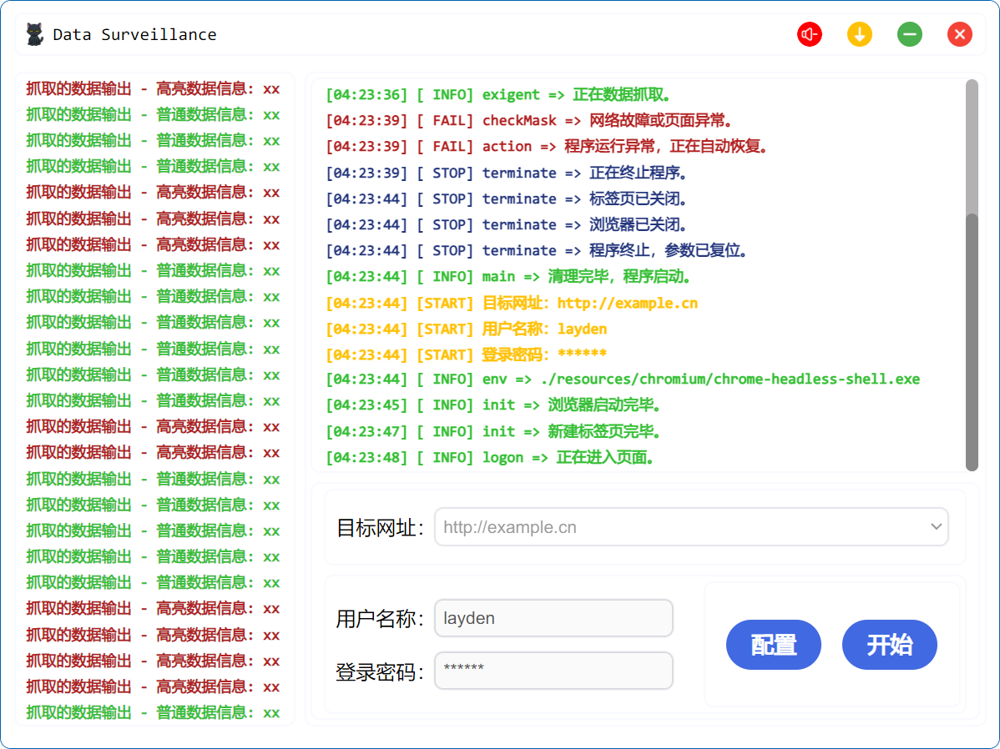
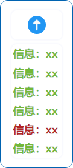

<div align="center"><h2>Data Surveillance</h2></div>

<div align="center"></div>

Data Surveillance 能够登录并抓取目标网址上的信息，并在主程序的 Message 区域上展示这些信息。

### 部署

```shell
npm start -dev
```

### 程序说明

- Title（顶部）：标题栏，提供静音、悬浮、最小化及关闭至托盘等功能；
- Message（左侧）：展示抓取的网页信息；
- Process（右上）：输出运行日志；
- Options（右下）：配置基本的登录信息。

<div align="center"></div>

### 悬浮窗体

使用标题栏中的悬浮按钮，可以启用小窗置顶模式，以显示 Message 区域信息：

<div align="center"></div>

### 框架

项目使用 [Electron Forge](https://www.electronforge.io/) 框架，以下命令用于初始化 [vue-electron](https://www.electronforge.io/templates/vite) 项目：

```shell
npm init electron-app@latest my-new-app -- --template=vite
```

### 打包

项目打包命令：

```shell
npm run make
```
